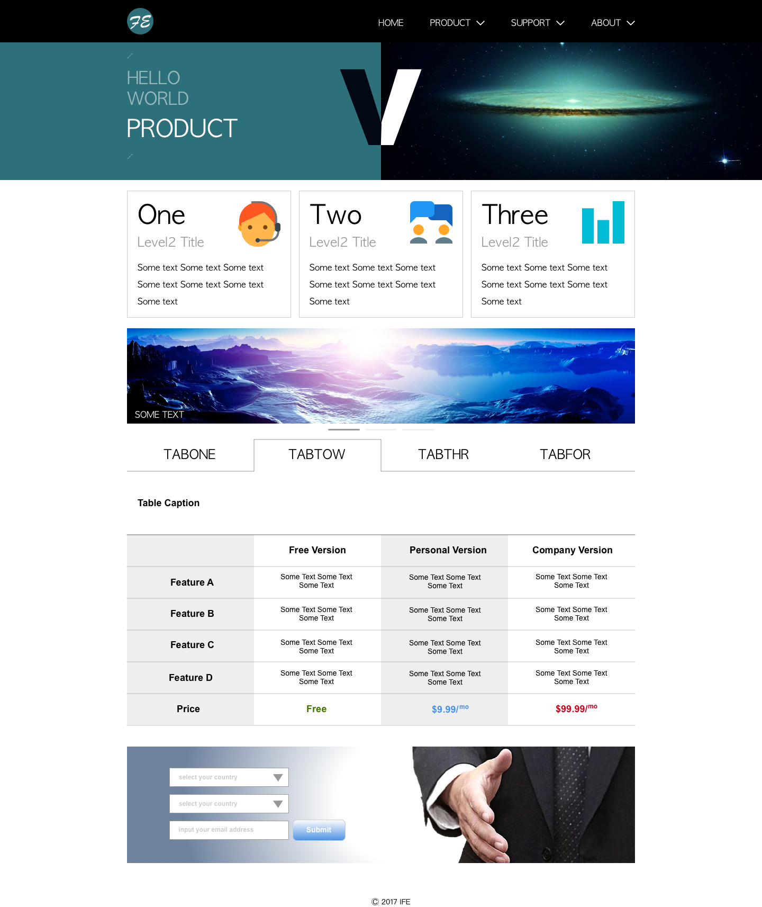

## 实验进度 12/66

### 代码编写

参考任务关联文件，第二阶段设计稿的两张设计稿，工作量整体预估为4-6小时，分两天完成

### 说明及要求

1. 仅需要实现HTML及CSS部分的编码，不涉及JavaScript部分；只需要实现设计稿的样式，不用实现交互。轮播图及tab切换等都先忽略功能及交互，做成静态展现即可。
2. 最上方的黑色导航背景部分宽度为100%自适应，Banner的左侧色块也是向左自适应延伸，右侧图片在浏览器宽度满足的情况下尽多显示，当浏览器宽度超过图片宽度时，图片右侧也用左侧的颜色进行填充
3. 整体页面有内容的宽度为960px定宽
4. 所有padding，margin请自行用工具量，基本上均为5，10的倍数
5. 字号大小分别为：导航16px；banner半透明文字32px，不透明文字44px；One Two Three模块，大标题48px，副标题24px，正文16px；中间banner左下角文字16px；tab导航24px；表格标题18px，表格表头行及左侧第一列18px；表格正文14px；价格行18px；输入框文字12px；按钮14px；版权14px
6. 符合语义化
7. 代码可以放在codepen或Github均可。
8. 页面背景色是白色的！大家请用photoshop等工具打开看
9. 页面在浏览器宽度大于960px时候，不出现横线滚动条
10. 设计稿中的图片资源可以直接使用设计稿切图，也可以自己寻找尺寸相同的图片
11. 设计稿中的文字可以直接使用设计稿中的文字，也可以随意写字。