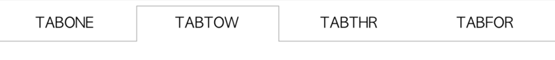
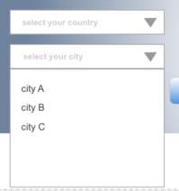

## 实验进度 19/66

接下来4个任务，任务19~22为同样内容，分四日完成

### 学习流程

#### 编码学习

基于之前的HTML任务，完成以下交互功能

#### 1. 下拉菜单

用两种方案实现如下图的下拉菜单，方案分别为使用JavaScript和不使用JavaScript

子菜单项数量及内容任意填写，不作要求。

下拉菜单的样式可参考上图，但不做强制的一致性要求，样式接近即可

交互方式为：

鼠标滑过（hover）一级菜单时，便弹出二级菜单，鼠标滑出hover的一级菜单及二级菜单后，二级菜单消失。

#### 2. 轮显Banner

如上图，自行寻找3-4张图片作为轮流显示的Banner图片，按照一定的时间（如2秒，可灵活配置），进行轮流显示

显示的动画实现两种效果，一种是淡入淡出，一种是左（或右）移动切换

banner下部的线代表当前轮流显示到哪张图，和图片轮显同步变更。

#### 3. Tab切换

 

点击tab，进行tab选中状态的切换，并更新tab下的内容

下方内容自定义，不作具体要求。

#### 4. 实现自定义样式下拉菜单Select并实现联动

实现如上图的下拉菜单样式，交互与系统默认的Select保持一致

联动：上面的下拉菜单选择会影响下面下拉菜单的可选项，Select中的选项自定义，不做要求。

例如：

上面选项是 无，中国，美国，英国

则对应下面选项为：

无：无

中国：北京、上海、广州

美国：洛杉矶、纽约、旧金山

英国：伦敦、利物浦、曼彻斯特

以上任务代码放在Github或codepen等上

#### 阅读练习

[JavaScript编码规范](https://github.com/ecomfe/spec/blob/master/javascript-style-guide.md)

#### 交流练习

1. 请在接下来4个任务进行过程中，至少安排一次团队面对面交流，人不方便集齐可以分小组讨论

2. 每天互相Review其他同学的代码，进行学习

#### 总结笔记

每天利用0.5小时的时间，在Teambition的分享中新增一篇笔记，完成一篇简要的学习笔记。

标题为：姓名_1/66学习笔记（例如：祖明_1/66学习笔记）

内容为：

本日新掌握的知识点：

有疑问的知识点：

心得体会：