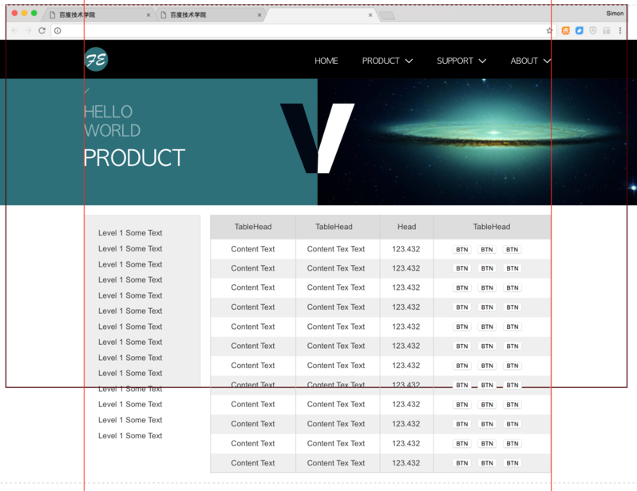

## 实验进度 24/66

任务24-27为一体，分4天完成

### 学习流程

### 编码学习

按照如下设计图及需求完成编码

</img>

图1

如图：

1. 黑色框和红色框均为参考线，非需要实现的边线。黑色框是表示浏览器窗口大小的一个大概示意。

2. 整个导航及banner和上一任务一致，可直接复用

3. 需要实现下方两个内容，左侧导航及右侧表格，表格单元格宽度自适应

4. 左侧导航的内容高度比浏览器的高度高，类似在图1的这种情况，左侧导航内部可以滚动，类似：[示例](http://echarts.baidu.com/examples.html)

5. 右侧表格高度超过屏幕高度，滚动的时候，整页进行滚动。

</img>

图2

6. 如图2，当浏览器整体滚动的时候，左侧导航会自适应增加高度，直至内容全部显示出来

7. 当浏览器滚动到表格表头的Top超出浏览器时，出现一个固定在浏览器窗口顶部的表头，表头各单元格宽度与内容表格各单元格宽度一致。

8. 不允许使用jQuery等组件或框架

### 阅读练习

[JavaScript编码规范](https://github.com/ecomfe/spec/blob/master/javascript-style-guide.md)