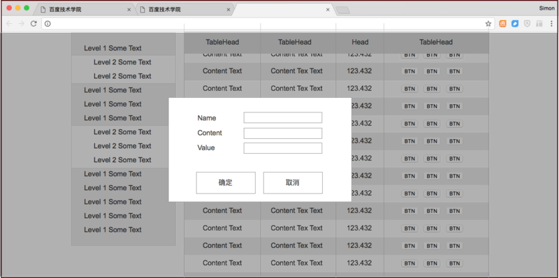
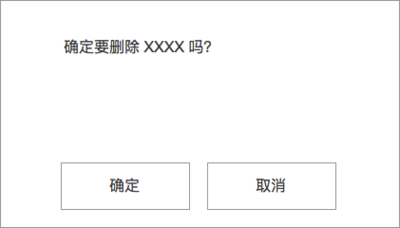

## 实验进度 29/66

任务29-32为一体，分4天完成

### 学习流程

#### 编码学习

按照如下设计图及需求完成编码

基于上一任务继续

</img>

任务1：

1.将左侧的导航升级为二级可折叠的导航。点击一级导航时，展开二级导航（如图），再次点击时收起

2. 设计一个JSON数据结构，用于记录这个二级导航的数据，新增一个JS文件，用于存储。

3. 将左侧导航的导航树通过读取2中的数据文件来动态生成。

</img>

任务2：

1. 设计一个JSON数据格式，用于存储右侧表格的数据，字段包括id, name, content, value，新建一个js文件，用于存储表格数据，请自行编写数据内容，数据具体内容不作要求。

2. 右侧表格通过读取1中新增的js文件中的JSON数据来动态生成表格，表格最右侧列的操作变为两项：编辑、删除

3. 点击编辑时，弹出如图浮层，有3个编辑项目及按钮，对编辑的项目的原值需要显示在input中。显示浮层的时候，页面下方有一个半透明遮罩，使得页面其他位置不可点击，出现浮层时，页面不可滚动。浮层需要横向纵向均居中，浮层及浮层内部具体样式不作要求。点击取消时，浮层和遮罩消失，数据不做变化。点击确认修改时，浮层和遮罩消失，表格中的内容进行对应更新。

4. 点击删除按钮时，依然弹出3中的浮层，里面内容变为确定要删除XXXX吗？

</img>

确定删除后，该行数据从表格中消失

注意：不允许使用任何框架和组件

#### 阅读练习

[JavaScript编码规范](https://github.com/ecomfe/spec/blob/master/javascript-style-guide.md)
