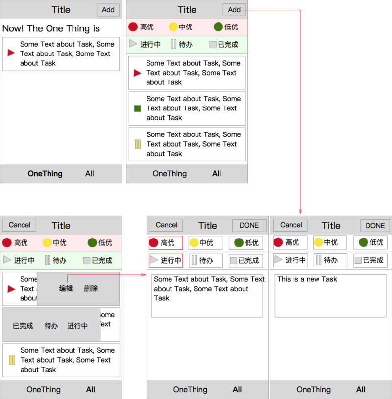

## 实验进度 43/66

任务43-47为同一任务

### 学习流程

#### 新知识练习

学习使用ES6及Webpack

http://exploringjs.com/es6/

http://webpack.github.io/

http://babeljs.io/

#### 任务练习

如下示意图，实现一个简单的todo管理的移动Web工具

</img>

0. 使用ES6，Webpack，LESS完成需求

1. 可以使用JQuery、Zepto、Hammer等基础库组件，但不允许使用react, vue等框架

2. 样式方面上图仅为示意图，不需要严格按照图去实现样式，可以使用bootstrap等样式库

3. 每个todo管理的任务有以下属性：任务内容、任务优先级（高中低），任务状态（待办、进行中、已完成）

4. 对于每个任务有如下操作：新增，编辑，删除

5. 在任务列表中，对每个任务进行向右滑动的手势，会从左到右滑入一个灰色块，上面有已完成，待办，进行中三个状态选择，可以直接更改状态

6. 在任务列表中，对每个任务进行向左滑动的手势，会从右到左滑入一个灰色块，上面有编辑和删除两个按钮，点击删除，直接从列表中删除，点击编辑，进入编辑界面。

7. 设计一个数据结构存储todo数据，数据存储在localStorage中

8. 下方菜单有两个选项，OneThing和ALL，OneThing显示最早添加的一个高优进行中的需求

9. ALL界面上方有优先级和任务状态的筛选按钮，点击后进行下面任务列表的筛选。筛选按钮均可多选

10. JS和CSS文件安装业务模块逻辑尽量拆分得细粒度

#### 交流练习

若有问题，积极主动和组内同学进行线上或线下的交流

#### 基础练习及知识点整理

参考http://naotu.baidu.com/file/dddd6d42fba7687aeb620066aa0e9376?token=6f0cbf3e06ea4f46
在百度脑图中建立自己的前端知识学习树，并在笔记中分享给大家。

建立知识树的时候，尽量拆解到较细粒度的知识点，比如是某个CSS属性，也可以是某个属性的某个具体值（当这个值比较特殊或者非常重要时候），对于每个知识点打上是否清晰的掌握的记号，也可以在每个知识点后面加上看过的一些参考资料。
